# 第二十一册：知识库 RAG 架构与时序图

本册将知识库 RAG 的整体架构与核心协作过程分开呈现，范围是当前本地 **Python + MySQL + Redis + MinIO + Elasticsearch** 主链路，源码核对日期为 2026-10-05。普通文件 Worker 使用默认 `TE_RUN_MODE=0`；Dataflow、GraphRAG、RAPTOR 等扩展分支不在普通解析图中展开。

- **架构图**：系统有哪些能力、子系统与数据资源，各自负责什么。
- **流程图**：一个请求或任务内部如何分支和执行。
- **时序图**：前端、API、Worker 和存储之间按什么顺序协作。

图只展示当前实现，不代表所有阶段具有统一事务或失败自动回滚保证。详细方法解释继续参阅[第二册](./02_文档摄取与深度解析.md)、[第三册](./03_检索问答与引用.md)、[第十八册](./18_知识库文档删除核心方法流程图.md)与[第十九册](./19_知识库文档核心流程图.md)。

## 1. 整体逻辑架构

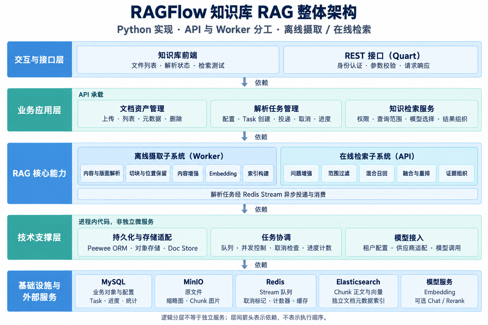

[打开 PNG 原图](./images/知识库RAG整体架构.png)。这张图片表达逻辑分层，不表达调用先后，也不意味着每层都是一个独立服务。

架构的三个关键设计：

1. **控制与计算分离**：API 负责文档资产、配置、任务生产和请求处理；Worker 承担耗时的解析、内容增强、向量化和索引构建。解析任务经 Redis Stream 异步投递与消费，API 不直接调用 Worker。
2. **离线构建、在线检索**：摄取子系统构建检索数据；检索子系统使用已有 Chunk 索引响应问题。这里的“离线”指后台异步处理，不表示断网，模型或解析器仍可能调用外部服务。
3. **按数据职责拆分存储**：MySQL 管业务对象、配置与状态；MinIO 管二进制资产；ES 管检索数据；Redis 管队列和执行协调。

技术支撑层是分别加载在 API / Worker 内的代码，不是额外的网关或第三个服务。两进程都能访问 MySQL、Redis、MinIO、ES；API 也直接执行 ES 检索、元数据查询和删除。

### 1.1 数据归属

| 数据类别 | 持久化位置 | 关联依据 |
|---|---|---|
| 知识库、文档、文件树与关联 | MySQL：`knowledgebase`、`document`、`file`、`file2document` | `kb_id`、`doc_id`、`file_id` |
| 解析任务事实状态与 Chunk ID 账本 | MySQL：`task` | `task.id`、`task.doc_id`、`chunk_ids` |
| 原文件与独立缩略图 | MinIO | 实际 bucket / object key；普通上传为 `kb_id + location` |
| 解析后的 Chunk 图片 | MinIO | 知识库、Chunk ID / `img_id` |
| Chunk 正文、分词、位置与向量 | ES：`ragflow_<tenant_id>` | ES `_id`、`kb_id`、`doc_id` |
| 文档级元数据 | ES：`ragflow_doc_meta_<tenant_id>` | `kb_id`、`doc_id`、`meta_fields` |
| 待执行通知、Pending、取消标记、文档计数器 | Redis | Stream / consumer group / task_id / doc_id |

ES 的租户索引名称和索引内 `kb_id` 过滤是两个不同层级。原文件实际地址应由 `File2DocumentService.get_storage_address()` 确定，不能根据显示文件名猜测。

## 2. 文档上传：时序图

以下以 `type=local`、首次上传为例。上传请求只完成资产落地，不切 Chunk、不调用 Embedding。

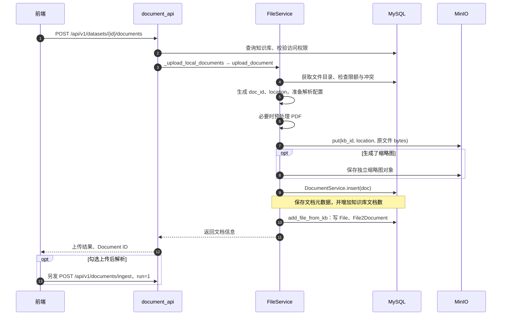

初始 `run=0`、`chunk_num=0` 来自模型默认值等初始化逻辑，不必在每个上传分支显式赋值。前端的“上传后解析”是独立的 ingest 请求，上传成功不代表解析已完成。

`web` 将网页转换成 PDF 后登记为文档；`empty` 创建空文档而不是目录。两者的对象与缩略图处理不等同于 local 分支，详见[第十九册第 2 节](./19_知识库文档核心流程图.md#2-document_apiupload_document导入入口与类型分流)。

### 2.1 文件与文档关联图

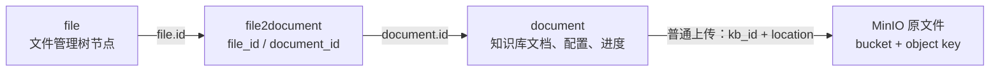

`File` 是文件树节点，`Document` 是知识库解析对象。链接文件管理器中已有文件时，原对象地址可能来自 `File.parent_id / location`，因此上图最后一条边只代表普通知识库上传。

## 3. 解析请求与 Task 投递：时序图

以下是普通文档 `run=1` 的主路径；`run=2` 的取消不能解释为向同一 Stream 投递一种新的“cancel Task”。

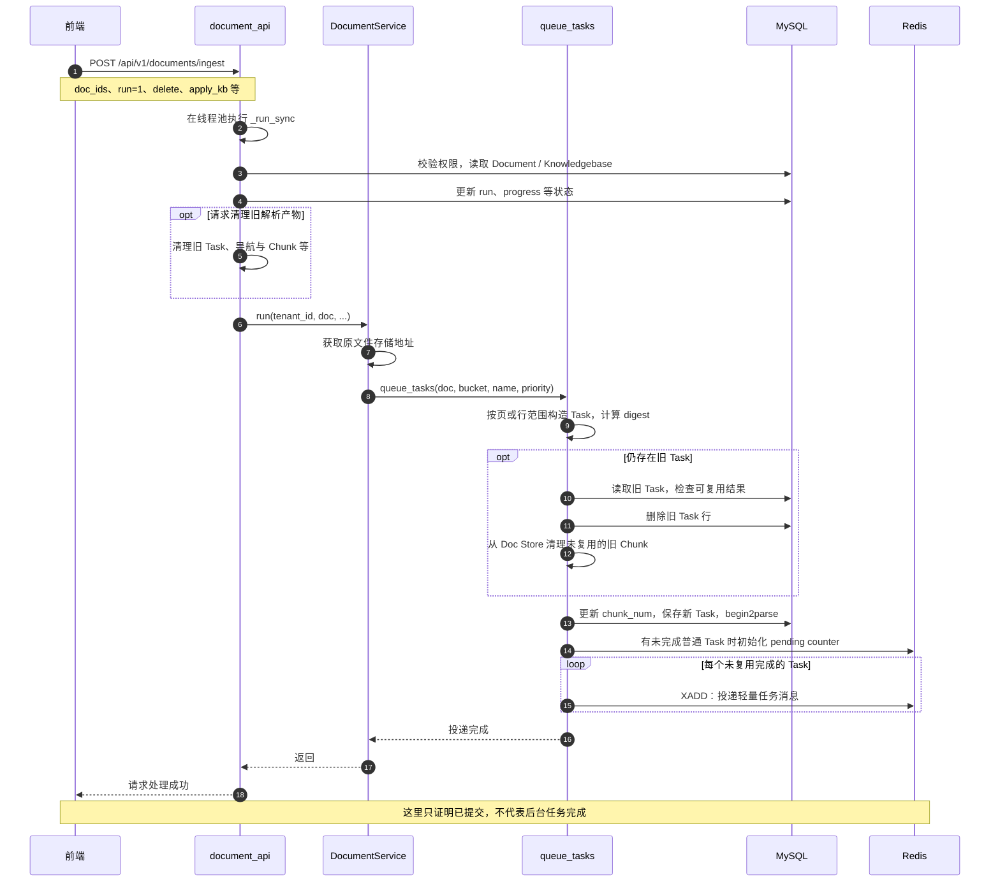

两个边界：

- 任务生产先写 MySQL 再发 Redis，但没有跨两者的统一事务。Task 入库成功而投递失败是需要排查的状态。
- `Task` 表没有 `parser_config` 列。Worker 使用 task_id 联表读取 Document / Knowledgebase，再构建运行上下文。Redis 也不保存完整的 TaskContext。

### 3.1 Document、Task 与 Chunk 的拆分关系

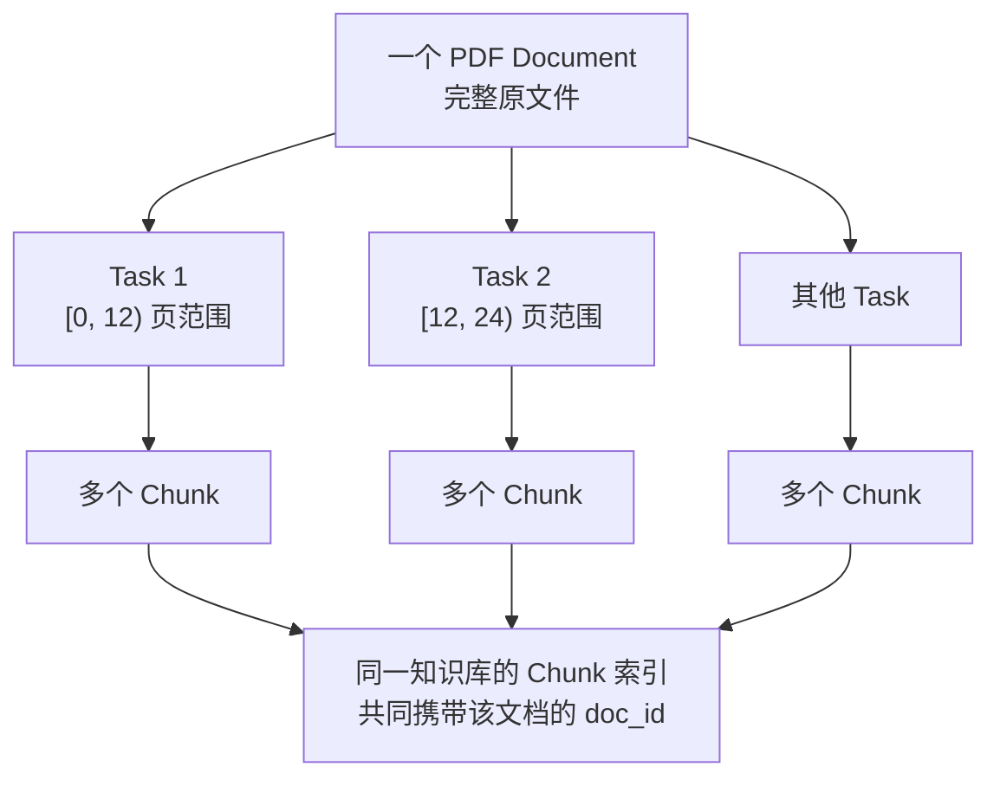

普通 PDF 默认按 12 页拆 Task，paper 默认 22 页，配置或特定解析策略可改变拆分；table 策略通常按 3000 行拆分。范围是 `[from_page, to_page)`，结束位置不包含在内。

每个 Task 取得的是完整原文件 bytes，具体解析器按页/行范围处理；Task 之间没有自动的跨 Task Chunk 重叠。一个 Task 也不等于一个 Chunk。

## 4. Worker 执行：流程图

`task_executor.handle_task()` 内部调用 `collect()`；不要将这个关系画反。下图展开默认重构路径中的普通文件 Task。

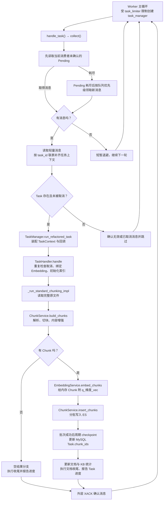

该图展开成功与空结果主路径。阶段内的失败/取消由回调和异常分支处理，标准解析异常还会标记文档 counter aborted；外层最终确认消息，并不保证失败任务自动进入重试队列。

- `StopIteration` 表示 Pending 迭代器耗尽，不是解析异常。
- `XACK` 移除消费组 Pending，不执行 `XDEL`，消息仍可留在 Stream。
- 取消是阶段间的协作检查，不会立即强制终止正在运行的解析线程或远端请求。
- Document 的整体进度聚合与各 Task 的进度回调是不同机制；不能把单个 Task 完成等同于整份文档完成。

### 4.1 Chunk 构建与向量落地：流程图

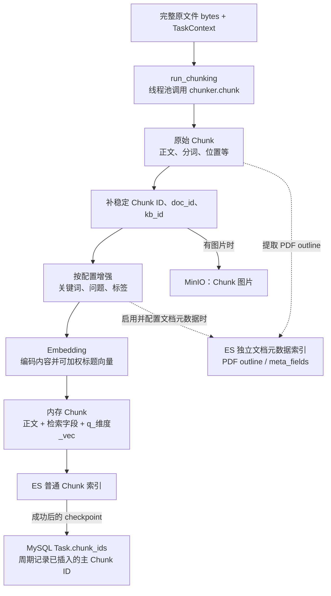

稳定 Chunk ID 是普通 ES 记录的 `_id`。`build_chunks()` 不生成向量、不写普通 Chunk 索引，但可能先写图片和独立文档元数据。Embedding 完成后，正文与向量一同落入普通 Chunk 索引。

`Task.chunk_ids` 在 ES 成功后周期更新，不是每个 Chunk 写入后立刻更新，也不是完整的续跑游标。母块、TOC 等产物不由这一字段统一完整记账。`update_chunk_ids()` 未检查 UPDATE 影响行数，不能据此保证并发删除 Task 后一定回滚已写 ES 数据。

## 5. 文档删除：时序图

按当前实际顺序绘制，区分文档与派生数据清理、文件关联清理、原文件条件删除。

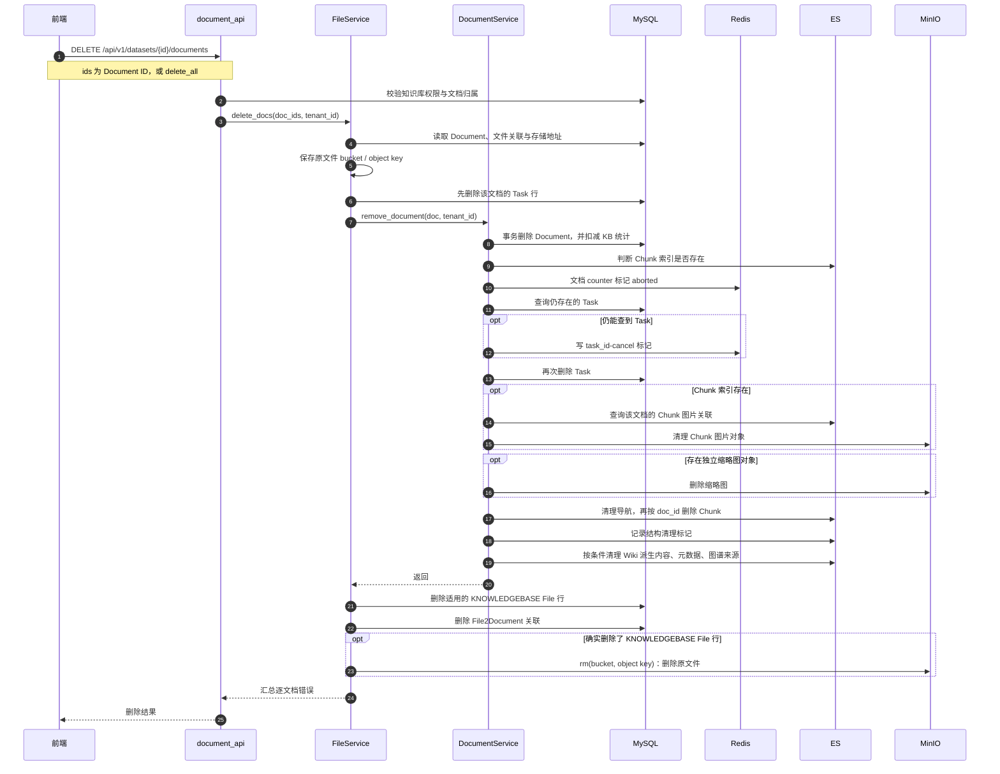

这里只对已找到的文档展开；Document 已不存在时 `remove_document()` 会提前返回，不继续扫描残留外部数据。表格字段映射等细分清理见[第十八册](./18_知识库文档删除核心方法流程图.md)。

必须保留的失败边界：

1. **跨存储不是统一事务**。MySQL 文档与知识库统计在同一事务内，ES、Redis、MinIO 不在其中。
2. **当前存在取消缺口**。外层先删 Task，内层通常无法再查到对应 task_id 写取消标记；counter aborted 不等于运行中的 Worker 已经停工。
3. **成功不等于全清空**。多项清理失败会记录日志并继续，部分失败可能留下对象或索引数据。
4. **原文件不是无条件删除**。必须实际删除了适用的 KNOWLEDGEBASE File 行，才执行原对象删除；已有本地文件的关联可能保留原文件。

## 6. 知识库文件列表：时序图

知识库详情页的文件列表以 MySQL Document 为主，不是 Chunk 全文/向量检索。

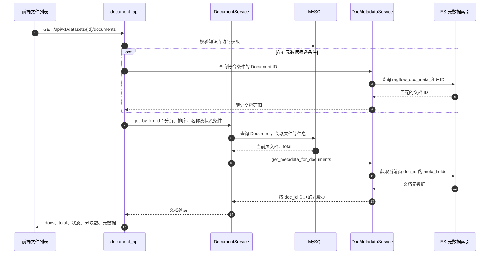

分块数、token 数、run/progress 来自 MySQL Document；`meta_fields` 来自独立元数据索引。顶部“文件管理”的列表以 File 为主，是另一个入口，不应混为知识库 Document 列表。

## 7. 知识库检索：时序图

入口是知识库检索测试 `search_datasets`。下图重点表示当前 ES 默认路径，以及配置 Rerank 后的替代分支。

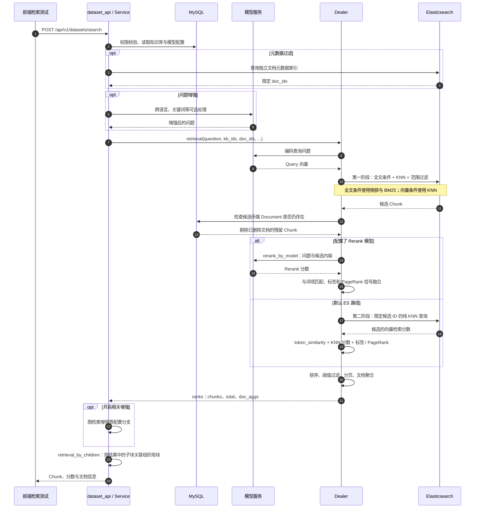

不要将当前实现简化为“BM25 分数 × 权重 + cosine × 权重”：

- 第一阶段构造全文表达式、KNN 与过滤，全文条件参与候选形成；默认固定融合设置使 ES bool boost 为 0，不能断言 BM25 数值贡献了默认首轮排序。
- 没有 Rerank 时，第二次 ES 查询限定已召回的 Chunk ID，取得纯 KNN `_score`，不扩大候选集合；当前代码没有将该分数反变换为原始 cosine。
- Python 使用 `token_similarity` 作为最终词法项，并融合 KNN 或 Rerank 分数、标签/PageRank 信号。这里不是直接复用首轮 BM25 `_score`。
- `total` 和文档聚合受当前候选窗口限制，不是全索引的全部潜在命中数。
- 检索测试返回证据，不生成最终答案。可选问题增强本身仍可能调用 Chat 模型；“不生成答案”不等于完全不调用 LLM。

### 7.1 检索与最终问答的边界

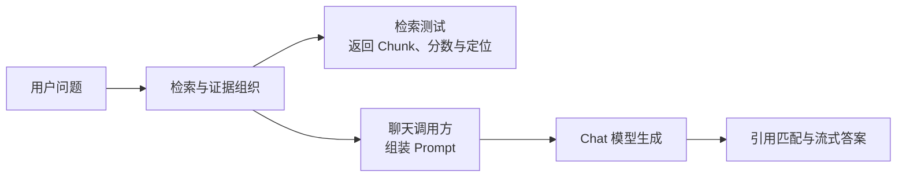

该图是能力关系，不表示聊天一定调用 `search_datasets()`。聊天有自己的编排入口，但复用 Dealer 检索能力。

## 8. 源码阅读与断点对应

以下路径相对于仓库根目录，按符号查找比固定行号更可靠。

| 图对应功能 | 核心符号 | 所在文件 |
|---|---|---|
| 上传、列表、解析、删除接口 | `upload_document`、`list_docs`、`ingest`、`delete_documents` | `api/apps/restful_apis/document_api.py` |
| 文件落地、关系与删除协调 | `upload_document`、`add_file_from_kb`、`delete_docs` | `api/db/services/file_service.py` |
| 文档列表与删除 | `get_by_kb_id`、`remove_document` | `api/db/services/document_service.py` |
| Task 生产与取消 | `queue_tasks`、`cancel_all_task_of`、`has_canceled` | `api/db/services/task_service.py` |
| 队列消费 | `handle_task`、`collect` | `rag/svr/task_executor.py` |
| 执行上下文装配 | `run_refactored_task` | `rag/svr/task_executor_refactor/task_manager.py` |
| 普通文档执行主链 | `_run_standard_chunking_impl` | `rag/svr/task_executor_refactor/task_handler.py` |
| Chunk 构建与索引插入 | `build_chunks`、`insert_chunks` | `rag/svr/task_executor_refactor/chunk_service.py` |
| 解析器调用 | `run_chunking` | `rag/svr/task_executor_refactor/chunk_builder.py` |
| 向量化 | `embed_chunks` | `rag/svr/task_executor_refactor/embedding_service.py` |
| 检索入口与业务编排 | `search_datasets` | `api/apps/restful_apis/dataset_api.py`、`api/apps/services/dataset_api_service.py` |
| 召回与重排 | `Dealer.retrieval`、`search`、`_knn_scores`、`rerank_by_model` | `rag/nlp/search.py` |

API 与 Worker 要分别 Debug。定位单份文档时，在实际取得 Task 后对 `doc_id / task_id` 使用条件断点；不要在空队列轮询处期待“只在提交解析请求后暂停”。
